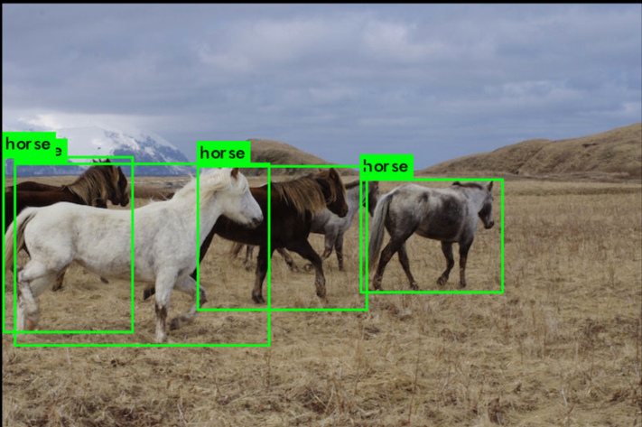
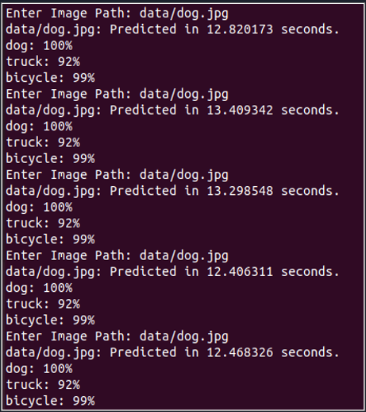
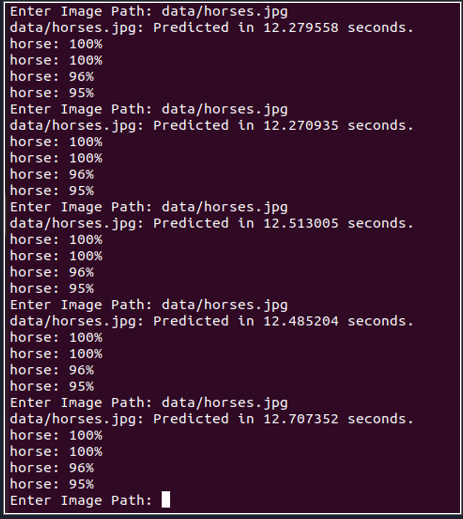

# YOLOv3 Performance Analysis on AMD Ryzen 9 5900HS

This project demonstrates the installation and performance evaluation of YOLOv3 (You Only Look Once, Version 3) using Darknet on an Ubuntu virtual machine, with a focus on analyzing its performance on an AMD Ryzen 9 5900HS processor.

## Overview

This project focuses on the installation and performance evaluation of YOLOv3 (You Only Look Once, Version 3) using Darknet, primarily on an Ubuntu virtual machine running on an AMD Ryzen 9 5900HS processor. The core objective is to assess and compare the performance of YOLOv3 across various computing environments and hardware configurations. This comparative analysis aims to provide a comprehensive understanding of how different setups impact the performance of YOLOv3, a crucial factor for applications ranging from academic research to real-world implementations.

The environments and systems used for performance comparison include:

1. **Emulation (Qemu) with RISC-V**: YOLOv3's performance was evaluated on a RISC-V architecture emulated in Qemu, using the same image as the one loaded onto an FPGA. This setup provides insights into YOLOv3's functionality and efficiency in emulated environments.

2. **Mac Terminal**: Running YOLOv3 natively in the Mac terminal offers a perspective on its performance in a macOS environment. This is vital for understanding its deployment and efficiency on Mac-based systems.

3. **Ubuntu VM on Mac**: The performance of YOLOv3 was also evaluated on an Ubuntu virtual machine hosted on a Mac, providing an understanding of the virtualization impacts on Mac hardware.

4. **Windows Ubuntu WSL2**: Here, YOLOv3 was run on Ubuntu using Windows Subsystem for Linux 2, shedding light on its performance in a Windows-hosted Linux environment. This is particularly relevant for users and developers in the Windows ecosystem.

5. **12th Gen Intel(R) Core(™) i7-12800HX (Bare Metal Ubuntu)**: Performance analysis was conducted on this high-performance Intel CPU running Ubuntu natively (bare metal). This setup represents a modern, high-end computing environment and serves as a benchmark for YOLOv3 performance on the latest Intel hardware.

6. **AMD Ryzen 9 5900HS (VMBox Ubuntu)**: The project's primary focus was on assessing YOLOv3's performance on this processor within a VirtualBox Ubuntu environment. This analysis is crucial for understanding the potential and limitations of YOLOv3 in virtualized setups on high-end AMD hardware.

Each of these setups offers unique insights into YOLOv3’s performance characteristics, helping to build a holistic view of its operational efficiency across different platforms and hardware configurations.

## Prerequisites

- VirtualBox
- Ubuntu (installed on VirtualBox)
- Darknet (YOLOv3 framework)
- AMD Ryzen 9 5900HS processor (Host machine specifications)

## Installation Guide

1. **Setting up VirtualBox:**
   - Download and install VirtualBox.
   - Create a new virtual machine for Ubuntu.

2. **Installing Ubuntu on VM:**
   - Download the Ubuntu ISO file.
   - Install Ubuntu on the virtual machine created in VirtualBox.

3. **YOLOv3 and Darknet Setup:**
   - Install necessary dependencies for Darknet and YOLOv3.
   - Clone the Darknet GitHub repository.
   - Compile Darknet using `make`.
   - Download the YOLOv3 weights.

## Running YOLOv3

1. **Testing YOLOv3:**
   - Use the command `./darknet detect cfg/yolov3.cfg yolov3.weights data/dog.jpg` to run object detection.
   - Repeat the detection task on the standard images (e.g., horses, dogs) multiple times.

2. **Performance Analysis:**
   - Record the time taken for each run.
   - Calculate the average performance time.
   - Note any observations regarding the performance on the VM as opposed to native hardware execution.

## Results

Based on the provided average prediction times, the dog images had an average prediction time of 12.880 seconds, while the horse images had a slightly faster average prediction time of 12.451 seconds.

These results indicate that, on average, the model processed the horse images slightly more quickly than the dog images. This difference could be due to various factors such as the complexity of the images, the differences in the features between dogs and horses that the model has learned to identify, or simply the variance between individual runs.

When implementing object detection models like YOLOv3, it's quite common to see some variation in prediction times based on the content of the images and the model's certainty in detecting and classifying objects within them. In this case, the relatively small difference in average times suggests that the model operates with comparable efficiency on both types of images in the given environment.

## Conclusion

The analysis of YOLOv3's performance on an AMD Ryzen 9 5900HS processor within a virtual machine environment demonstrated a high level of efficiency, with horse images being processed marginally faster than dog images. This consistent performance, with minimal impact from virtualization, indicates the AMD Ryzen 9 5900HS's suitability for demanding machine learning tasks and suggests that advanced object detection models like YOLOv3 can be effectively deployed in virtualized setups. The results serve as a benchmark for machine learning applications in similar hardware scenarios, offering valuable insights for optimizing such models in diverse computing environments.

## Future Work

Future enhancements to this project will involve expanding the capabilities of YOLOv3 to process real-time video feeds and a wider array of images. Implementing computer vision (CV) libraries, such as OpenCV, will enable the integration of live camera input, facilitating the analysis of dynamic scenes and moving objects. This will not only test the robustness of YOLOv3 in more complex and variable conditions but also simulate real-world applications such as surveillance, traffic monitoring, and interactive systems. Additionally, experimenting with different image sets will provide a more comprehensive understanding of the model's performance across diverse subjects and scenarios. The exploration of these areas will contribute to the development of more advanced and practical object detection systems, further leveraging the computational power of the AMD Ryzen 9 5900HS processor within virtualized environments.

## References

[Darknet](https://pjreddie.com/darknet/).
[YOLOV3](https://pjreddie.com/darknet/yolo/).
[How To Install Ubuntu On VM](https://ubuntu.com/tutorials/how-to-run-ubuntu-desktop-on-a-virtual-machine-using-virtualbox#3-install-your-image).

---

*This project is a demonstration and does not guarantee optimal performance under all hardware configurations. Your results may vary based on different system specifications.*
